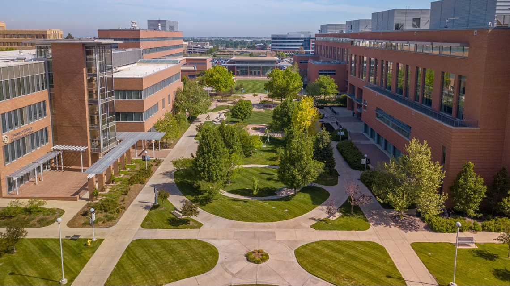

::: {#pcc}
## Skills

I can wiggle my ears.

I can fold a fitted sheet.

I can go down a mountain with my feet strapped to a piece of wood (a.k.a. snowboard)

## Education 

For high school, I attended Centennial High School in Pueblo, Colorado from 2019 - 2022. I graduated early as a junior.

For college, I am attending the University of Colorado Denver and getting a bachelor's degree in Mathematics - Probability and Statistics. I am graduating this semester. Yay!

For a post graduate education, I will attend medical school starting in July.

The University of Colorado Anschutz School of Medicine is located in Aurora, Colorado.
:::
